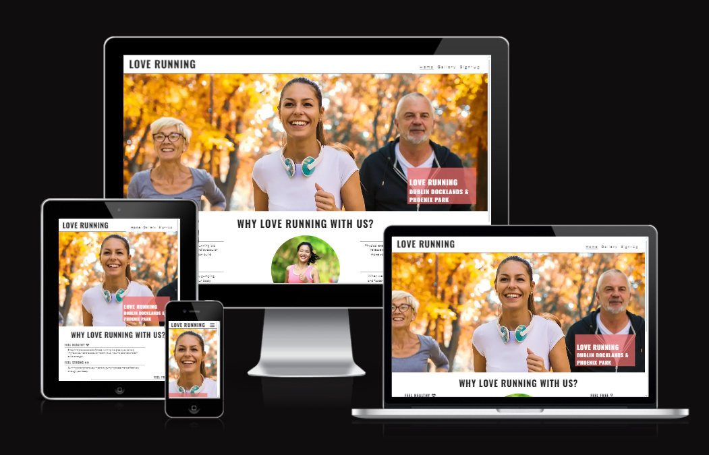

# Love Running Project

## Overview

Welcome to the Love Running project, an engaging and responsive website built from the ground up. This project is part of the Code Institute curriculum, designed to teach the fundamentals of web development with a focus on mobile-first design.

### Key Features

- **Mobile-First Design**: Developed for optimal performance on mobile devices before scaling up to larger screens.
- **Responsive Navigation**: Features a burger icon toggle for navbar items on mobile, expanding to a full navbar on larger screens.
- **Hero Image**: A striking image of a runner enhances the visual appeal and sets the theme for the site.
- **Club Information**: Includes motivational reasons for joining, meeting times, and location details.
- **Social Media Integration**: Footer links to social media platforms provide additional engagement.
- **Gallery Page**: Showcases photos from past events, arranged responsively.
- **Signup Page**: Allows users to sign up for the club with form validation to ensure complete submissions.
- **Adaptive Layout**: Content layout changes gracefully from mobile to tablet and desktop views, utilizing the available screen space effectively.

### Technologies Used

- HTML5
- CSS3

### Setup

Clone this repository and open `index.html` in any modern browser to view the project.

---

This project is a walkthrough of the development process, demonstrating key concepts in responsive web design and front-end development.